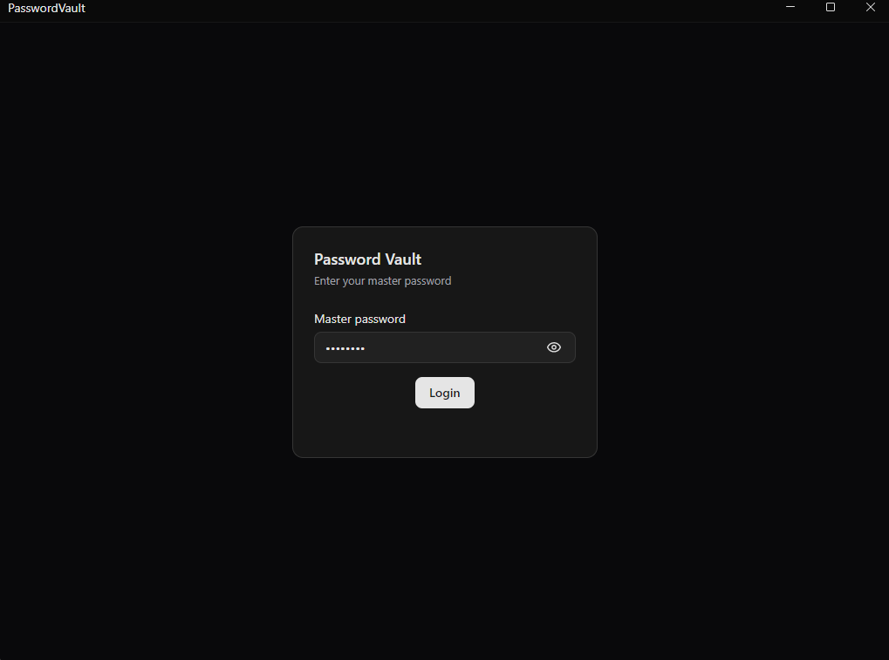
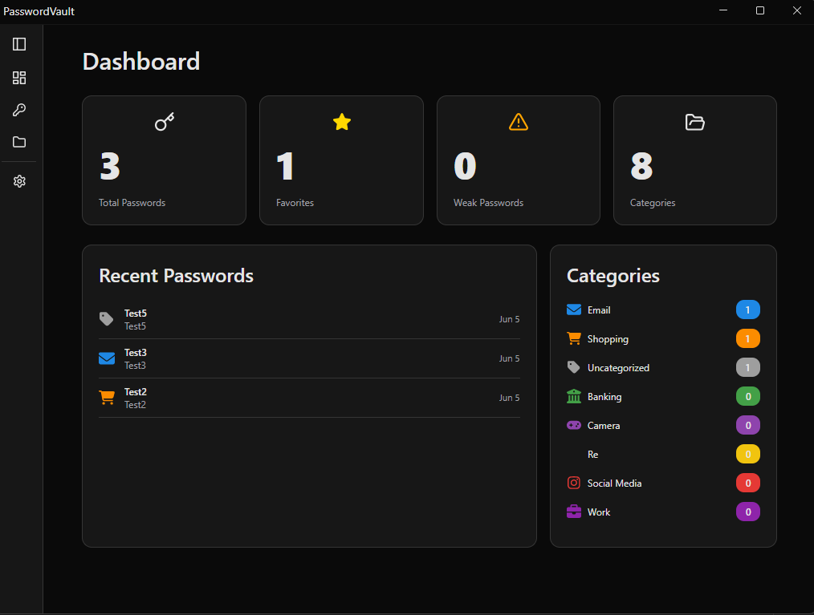
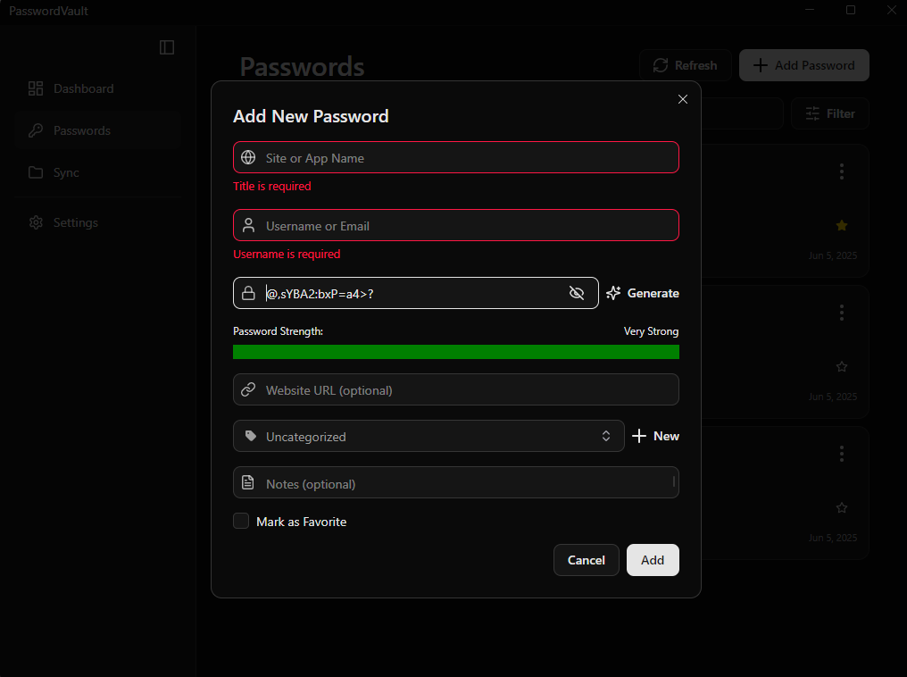

# PasswordVault

A secure password manager built with .NET 8 and Avalonia UI.

> ⚠️ **Work in Progress** — This project is under active development. Some features are still being implemented.


## Screenshots

<p align="center">
  
  
  
</p>

## Features

- AES-256-GCM encryption for all stored passwords
- Argon2id master password authentication (memory-hard, resistant to GPU attacks)
- Organize passwords by category with custom icons
- Password generator with strength analysis
- Dark/light theme support
- Local encrypted storage using LiteDB

## Security

All sensitive data is encrypted with AES-256-GCM. The master password is never stored — instead, Argon2id derives a 256-bit key used for encryption.

| Component | Details |
|-----------|---------|
| Key Derivation | Argon2id, 64 MB memory, 3 iterations |
| Encryption | AES-256-GCM |
| Storage | LiteDB (encrypted) |

## Tech Stack

- .NET 8
- Avalonia 11.3 + ShadUI
- CommunityToolkit.Mvvm
- LiteDB
- Konscious.Security.Cryptography (Argon2)

## Getting Started

```bash
# Clone
git clone https://github.com/yourusername/PasswordVault.git
cd PasswordVault

# Run
dotnet run
```

## Project Structure

```
PasswordVault/
├── Models/           # Data models
├── Services/
│   ├── Auth/         # Authentication (Argon2id)
│   ├── Crypto/       # Encryption (AES-256-GCM)
│   └── Database/     # Data access
├── ViewModels/       # MVVM view models
├── Views/            # UI
└── Helper/           # Password generator
```

## Planned Features

- [ ] Windows Hello / biometric unlock
- [ ] Cross-device sync
- [ ] Browser extension
- [ ] Breach detection (HaveIBeenPwned)
- [ ] Import from other password managers

## License

MIT